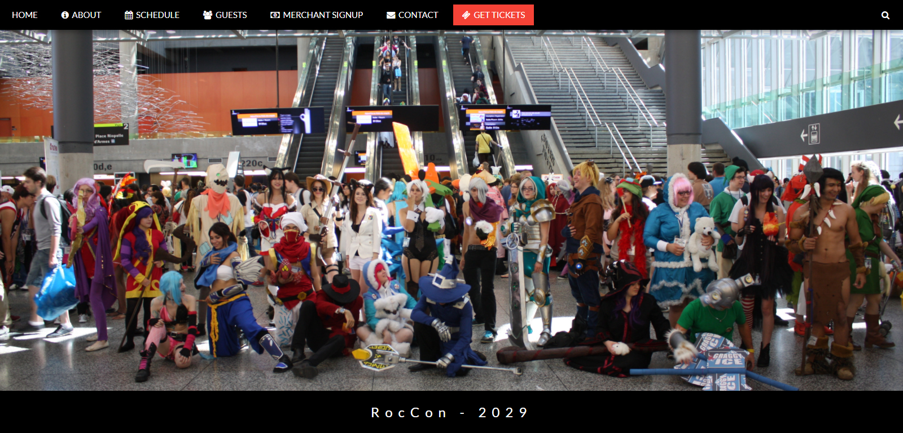

Name: Joseph Morris
Date: 10/24/2017

[Click here for live demo!](http://themanysidesof.me/demo/30D30SD2/ "Click here for live demo!")

# Description:
30 Days, 30 Sites - Day 2: Event Invitation

This is meant to be an "Event Invitation" site. I chose, instead, to make a mobile-friendly update for the RocCon website. RocCon is a anime/comic convention hosted here in Rochester. This site is a fictional representation of RocCon 2029! It utilizes W3.css and was loosely based on the W3 Parallax template. Vanilla JS was used for the various features of the site.
